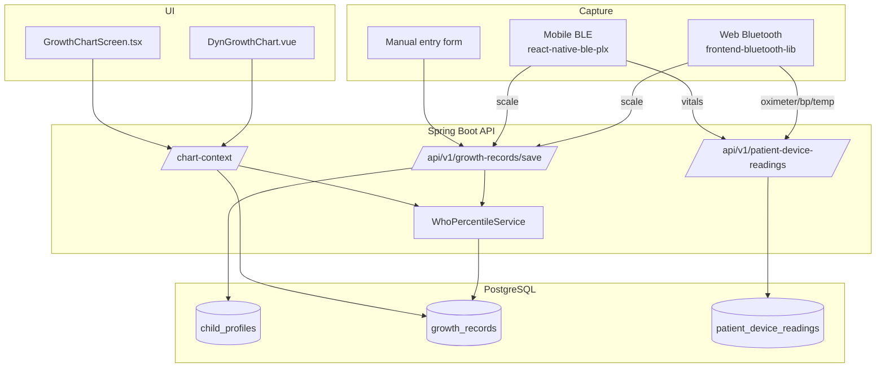

# Growth & Vitals Tracking — Architecture-Aligned Implementation Plan

**Agastya Healthcare — Longitudinal pediatric growth tracking with BLE device integration and WHO percentile curves**

This plan adapts the reference design in `~/Downloads/agastya-growth-vitals-cursor-plan.md` to the **current** saas-builder-project architecture. It extends existing foundations rather than introducing parallel systems.

---

## Executive summary

| Area | Current state | This feature adds |
|------|---------------|-------------------|
| Device readings | `patient_device_readings` (JSONB, patient-scoped, Web BLE working) | Child linkage, appointment linkage, doctor read access, scale profile |
| Growth / WHO | None | `child_profiles`, `growth_records`, `WhoPercentileService`, chart APIs |
| BLE mobile | Stub README only | Port `frontend-bluetooth-lib` parsers via `react-native-ble-plx` |
| BLE web | `DynBluetoothDevices` on Devices dashboard tab | Scale + growth save flow; doctor chart view |
| Triage | Ephemeral `ChildAgeMonths` / `ChildWeightKg` per session | Optional link to `child_profile_id` later (not MVP) |

**Quick win (demo first):** Manual growth entry + WHO chart on web — no BLE required. BLE is polish on an already-working longitudinal chart.

**Estimated effort:** ~18–22 hours across 9 phases (reference estimate holds; +2h for architecture alignment work).

---

## Architecture alignment decisions

These differ from the reference plan where the codebase already has conventions:

### 1. Extend `patient_device_readings` — do not create `vitals_records`

The reference plan proposes a separate `vitals_records` table. **Reject that.** Vitals (SpO₂, BP, HR, temp) already live in `patient_device_readings.measurements` JSONB with parsers in `frontend-bluetooth-lib`.

**Instead (migration `V24__growth_and_child_profiles.sql`):**

- Add nullable FKs to `patient_device_readings`:
  - `child_profile_external_id UUID` → `child_profiles.external_id`
  - `appointment_external_id UUID` → `appointments.external_id`
  - `recorded_by_user_id TEXT` → `users.id`
- Add `{Entity}QueryDto` filters: `ChildProfileExternalId`, `DeviceType`, `RecordedAtFrom`, `RecordedAtTo`

Raw BLE vitals continue to POST to `/api/v1/patient-device-readings`. Growth-specific metrics (height, weight, HC, computed BMI + percentiles) go to a new `growth_records` table.

### 2. New `growth_records` — not merged into device readings

Growth needs stored percentiles, age-at-recording, and chart aggregation. A dedicated entity keeps WHO computation on write and chart queries fast.

### 3. New `child_profiles` — required (no equivalent exists)

Triage stores per-session `ChildAgeMonths` / `ChildWeightKg` (`V23__triage_results.sql`) but has no persistent child identity, DOB, or sex. WHO math requires DOB + sex.

### 4. BLE device registry — extend `frontend-bluetooth-lib`, not a new `ble_devices` table (MVP)

Web already uses in-browser pairing (no persisted MAC). For MVP:

- **Web:** Continue ephemeral Web Bluetooth sessions via `DEVICE_REGISTRY` in `frontend-bluetooth-lib/src/bluetooth/deviceRegistry.ts`.
- **Mobile:** Add `react-native-ble-plx` + port parsers; optional `ble_devices` persistence is **Phase 2 polish** (reference Phase 4 device list screen).

If persisted devices are needed later, add `ble_devices` with `external_id` UUID and v1 CRUD — not in MVP.

### 5. API paths — v1 kebab-case plural (`entity-crud-endpoints.mdc`)

| Reference path | Aligned path |
|----------------|--------------|
| `/api/children` | `/api/v1/child-profiles` |
| `/api/children/{id}/growth` | `/api/v1/growth-records` (filter `Query.ChildProfileExternalId`) |
| `/api/children/{id}/vitals` | `/api/v1/patient-device-readings` (extended filters) |
| `/api/ble-devices` | Deferred (MVP) |
| `/api/who/percentile-curves` | `/api/v1/who/percentile-curves` (read-only catalog — CRUD exempt) |

**Combined chart endpoint** (per `api-combined-endpoints.mdc`):

```
GET /api/v1/child-profiles/{externalId}/growth/chart-context
  ?Metric=wfa&FromMonths=0&ToMonths=60
```

Returns in one response:

```json
{
  "Success": true,
  "Data": {
    "ChildProfile": { "ExternalId": "…", "DisplayName": "…", "DateOfBirth": "…", "Sex": "male" },
    "Records": [ { "RecordedAt": "…", "WeightKg": 12.4, "WeightPercentile": 45.2, "Source": "manual" } ],
    "PercentileCurves": { "P3": [], "P15": [], "P50": [], "P85": [], "P97": [] },
    "LatestSummary": { "WeightPercentile": 45.2, "HeightPercentile": 52.1, "InterpretationBand": "normal" }
  }
}
```

Frontend makes **one** call per chart render, not separate records + curves fan-out.

### 6. Security — Spring `@PreAuthorize`, not Supabase RLS

Reference plan mentions RLS policies. This project enforces access in Spring:

| Role | `child-profiles` | `growth-records` | `patient-device-readings` |
|------|------------------|------------------|---------------------------|
| PATIENT | CRUD own children | CRUD own children's records | CRUD own (existing) |
| DOCTOR | GET children of patients with shared appointments | GET + POST during appointment | GET + POST during appointment |
| ADMIN | GET oversight | GET | GET |

Extend `PatientDeviceReadingService` — currently **patient-only** — with doctor read path scoped to appointment/patient relationship.

### 7. Postgres gating (mandatory)

All new entities follow the same pattern as `PatientDeviceReadingController`:

```java
@ConditionalOnProperty(name = "app.persistence.provider", havingValue = "postgres")
```

Default `app.persistence.provider=mongo` returns `501`. Document `APP_PERSISTENCE_PROVIDER=postgres` in dev setup.

### 8. Wire format conventions

- PascalCase JSON keys everywhere (`api-json-pascal-case.mdc`)
- List responses: `Data` = row array; `Page`/`Size`/`TotalCount` on envelope
- Server-localized `Message` (`server-message-i18n.mdc`); clients send `Accept-Language`
- Business key = `external_id` UUID on all entities
- Soft delete: `deleted BOOLEAN` (matches `patient_device_readings`, not `deleted_at`)

### 9. Chart libraries

| Surface | Library | Notes |
|---------|---------|-------|
| Web (Vue) | Chart.js via `vue-chartjs` | New `DynGrowthChart.vue` primitive + config-driven page |
| Mobile (RN) | `victory-native` | New `GrowthChartScreen.tsx` |

### 10. Fix existing debt before/alongside feature

- `frontend-hospital/src/services/http/patientDeviceReadingApi.ts` — list handler may expect `Data.content` instead of envelope `Data` array; align with `parsePagedEntityList` from `hospital-api-client`
- Add typed parsers for device readings in `packages/hospital-api-client/src/index.ts` (path constant exists; parsers missing)
- Add `scale` to `DeviceType` in `frontend-bluetooth-lib` (Xiaomi Mi Scale / generic body composition)

---

## Data model

### Migration: `V24__growth_and_child_profiles.sql`

```sql
-- child_profiles: one parent (patient user) → many children
CREATE TABLE child_profiles (
    id                      BIGSERIAL PRIMARY KEY,
    external_id             UUID NOT NULL DEFAULT gen_random_uuid() UNIQUE,
    patient_user_id         TEXT NOT NULL REFERENCES users (id),
    display_name            VARCHAR(128) NOT NULL,
    date_of_birth           DATE NOT NULL,
    sex                     VARCHAR(8) NOT NULL CHECK (sex IN ('male', 'female')),
    blood_group             VARCHAR(8),
    created_at              TIMESTAMPTZ NOT NULL DEFAULT now(),
    updated_at              TIMESTAMPTZ NOT NULL DEFAULT now(),
    deleted                 BOOLEAN NOT NULL DEFAULT false
);

CREATE INDEX idx_child_profiles_patient ON child_profiles (patient_user_id)
    WHERE deleted = false;

-- growth_records: structured measurements + WHO percentiles at write time
CREATE TABLE growth_records (
    id                          BIGSERIAL PRIMARY KEY,
    external_id                 UUID NOT NULL DEFAULT gen_random_uuid() UNIQUE,
    child_profile_external_id   UUID NOT NULL REFERENCES child_profiles (external_id),
    recorded_at                 TIMESTAMPTZ NOT NULL,
    recorded_by_user_id         TEXT REFERENCES users (id),
    age_months_at_recording     NUMERIC(6,2) NOT NULL,
    height_cm                   NUMERIC(5,2),
    weight_kg                   NUMERIC(5,2),
    head_circumference_cm       NUMERIC(5,2),
    bmi                         NUMERIC(5,2),
    height_percentile           NUMERIC(5,2),
    weight_percentile           NUMERIC(5,2),
    bmi_percentile              NUMERIC(5,2),
    hc_percentile               NUMERIC(5,2),
    source                      VARCHAR(32) NOT NULL DEFAULT 'manual'
        CHECK (source IN ('manual', 'ble_scale', 'ble_imported', 'clinic')),
    appointment_external_id     UUID REFERENCES appointments (external_id),
    device_reading_external_id  UUID REFERENCES patient_device_readings (external_id),
    notes                       TEXT,
    created_at                  TIMESTAMPTZ NOT NULL DEFAULT now(),
    deleted                     BOOLEAN NOT NULL DEFAULT false
);

CREATE INDEX idx_growth_records_child_time ON growth_records (child_profile_external_id, recorded_at)
    WHERE deleted = false;

-- Extend patient_device_readings for child + appointment linkage
ALTER TABLE patient_device_readings
    ADD COLUMN child_profile_external_id UUID REFERENCES child_profiles (external_id),
    ADD COLUMN appointment_external_id UUID REFERENCES appointments (external_id),
    ADD COLUMN recorded_by_user_id TEXT REFERENCES users (id);

CREATE INDEX idx_pdr_child_time ON patient_device_readings (child_profile_external_id, recorded_at)
    WHERE deleted = false AND child_profile_external_id IS NOT NULL;
```

**BMI:** Computed server-side on save: `weight_kg / (height_m)²` when both present.

**Age:** Computed server-side: months between `child_profiles.date_of_birth` and `recorded_at` (store as `age_months_at_recording`).

---

## Phase 1 — WHO percentile engine (backend) · ~3h

**Hardest piece — build first.**

### Files to create

```
backend-hospital/src/main/resources/who-data/
  wfa-boys-0-5.csv, wfa-girls-0-5.csv
  lhfa-boys-0-5.csv, lhfa-girls-0-5.csv
  bfa-boys-0-5.csv, bfa-girls-0-5.csv
  hcfa-boys-0-5.csv, hcfa-girls-0-5.csv

backend-hospital/src/main/java/com/flexshell/growth/
  WhoGrowthMetric.java          // WFA, LHFA, BFA, HCFA enum
  WhoLmsRow.java
  WhoLmsTable.java
  WhoDataLoader.java            // @PostConstruct CSV load + linear interpolation
  WhoPercentileService.java     // computePercentile(), getPercentileCurve()
  GrowthMeasurementValidator.java  // range checks before save
```

### Core algorithm (LMS method)

```
Z = ((X/M)^L - 1) / (L × S)     // if L ≠ 0
Z = ln(X/M) / S                  // if L = 0
Percentile = Φ(Z) × 100        // Apache Commons Math NormalDistribution
Clamp to [0.01, 99.99]
```

### Tests

`backend-hospital/src/test/java/com/flexshell/growth/WhoPercentileServiceTest.java` — spot-check known WHO published values at 0, 6, 12, 24 months.

### Build gate

```bash
cd backend-hospital && gradle compileJava
```

---

## Phase 2 — WHO curves API + caching · ~1h

```
GET /api/v1/who/percentile-curves?Metric=wfa&Sex=male&FromMonths=0&ToMonths=60
```

- Response: `PercentileCurves` with `P3`, `P15`, `P50`, `P85`, `P97` arrays of `{ AgeMonths, Value }`
- `@Cacheable` key = `who_curves_{metric}_{sex}_{from}_{to}`
- `Cache-Control: public, max-age=86400` on HTTP response
- PermitAll or authenticated read — data is not PHI

Controller: `WhoPercentileV1Controller.java` (read-only catalog — no `/save`).

---

## Phase 3 — Child profiles + growth records CRUD · ~2.5h

### Backend

| Layer | Path |
|-------|------|
| Entities | `ChildProfileJpaEntity.java`, `GrowthRecordJpaEntity.java` |
| Repos | `ChildProfileJpaRepository.java`, `GrowthRecordJpaRepository.java` |
| Services | `ChildProfileService.java`, `GrowthRecordService.java` |
| Controllers | `ChildProfileV1Controller.java`, `GrowthRecordV1Controller.java` |

### Endpoints

**Child profiles** — `/api/v1/child-profiles`

| Method | Path | Notes |
|--------|------|-------|
| GET | `/api/v1/child-profiles` | Paginated; `Query` filter by `DisplayName` |
| POST | `/api/v1/child-profiles/save` | Upsert by `ExternalId` |
| DELETE | `/api/v1/child-profiles/{externalId}` | Soft-delete |
| GET | `/api/v1/child-profiles/{externalId}/growth/chart-context` | Combined chart payload |

**Growth records** — `/api/v1/growth-records`

| Method | Path | Notes |
|--------|------|-------|
| GET | `/api/v1/growth-records?Query={"ChildProfileExternalId":"…"}` | Paginated, default sort `recordedAt,asc` |
| POST | `/api/v1/growth-records/save` | Upsert; auto-compute age, BMI, percentiles on write |
| DELETE | `/api/v1/growth-records/{externalId}` | Soft-delete |

**Legacy alias (optional):** None needed — greenfield entity.

### DTOs (PascalCase)

- `ChildProfileSaveRequest`, `ChildProfileResponse`
- `GrowthRecordSaveRequest`, `GrowthRecordResponse`
- `GrowthChartContextResponse` (combined)
- `ChildProfileQueryDto`, `GrowthRecordQueryDto`

### i18n keys (add to `hospital-messages_en.properties` / `_hi.properties`)

- `growth.child.saved`, `growth.record.saved`, `growth.record.invalid_range`
- `growth.percentile.underweight`, `growth.percentile.normal`, `growth.percentile.overweight`

### Entity inventory update

Add to `entity-crud-endpoints.mdc` inventory:

| Entity | v1 paths |
|--------|----------|
| Child profile | `GET/POST save/DELETE` on `/api/v1/child-profiles` |
| Growth record | `GET/POST save/DELETE` on `/api/v1/growth-records` |

---

## Phase 4 — Extend patient device readings · ~1.5h

### Backend changes

- `PatientDeviceReadingCreateRequest` / `SaveRequest`: add `ChildProfileExternalId`, `AppointmentExternalId`
- `PatientDeviceReadingService`: doctor read path; validate appointment ownership
- `PatientDeviceReadingQueryDto`: filter by child, device type, date range

### BLE device registry (web)

Add to `frontend-bluetooth-lib/src/bluetooth/deviceRegistry.ts`:

```typescript
type DeviceType = … | 'scale';

XIAOMI_MI_SCALE: {
  type: 'scale',
  serviceUUIDs: ['0000181b-0000-1000-8000-00805f9b34fb'],
  characteristicUUID: '00002a9c-0000-1000-8000-00805f9b34fb',
  measurementKeys: ['weight_kg'],
  namePrefixes: ['MI_SCALE', 'MIBCS', 'XMTZC'],
  …
}
```

Add `parseScaleData()` in `bluetoothService.ts` — reuse reference byte layout from original plan.

### Save flow (web)

`DynBluetoothDevicesHost.vue` → on reading:

1. If `deviceType === 'scale'` and child selected → `POST /api/v1/growth-records/save` with `Source: ble_scale`
2. Else → existing `POST /api/v1/patient-device-readings` with optional child/appointment FKs

---

## Phase 5 — Web UI (Vue) · ~3h

### New primitives

| Component | Role |
|-----------|------|
| `DynChildProfileSelector.vue` | Pick active child (Pinia `GrowthNav` store) |
| `DynGrowthChart.vue` | Chart.js percentile bands + child scatter |
| `DynGrowthLatestCard.vue` | Latest reading + colored percentile badge |
| `DynGrowthHistoryTable.vue` | Doctor table with velocity column + flags |
| `DynGrowthManualEntryForm.vue` | Height/weight/HC inputs |

### Config-driven pages (match triage/devices pattern)

```
frontend-hospital/src/configs/hospital/
  growthPage.ts              // patient growth dashboard tab
  growthPopupPage.ts         // manual entry popup
  growthChartPanel.ts        // dashboard panel when nav activeItem === 'growth'
```

Register in `pages.ts`, `hospitalRoutes.ts` e2e manifest.

### Services

```
frontend-hospital/src/services/domain/hospital/growth/
  childProfileServices.ts
  growthRecordServices.ts
  growthChartServices.ts     // wraps chart-context endpoint

frontend-hospital/src/services/http/
  growthApi.ts
```

Add paths to `apiPaths.ts` and `packages/hospital-api-client/src/index.ts`.

### Dashboard nav

Extend patient dashboard left nav (alongside existing Devices tab in `devicesDashboardPanel.ts`) with a **Growth** tab gated by `condition.flag: enableGrowthTracking` in static config.

### Doctor view

On appointment detail / doctor dashboard: inline "Record measurements" section posting to `growth-records/save` + `patient-device-readings` with `AppointmentExternalId`. Reuse `DynGrowthLatestCard` as compact summary widget.

### Disclaimer (required on all charts)

> "For informational purposes only. Consult your doctor for clinical interpretation."

---

## Phase 6 — Mobile BLE module · ~3h

### Dependencies

```bash
cd mobile-hospital && npx expo install react-native-ble-plx
```

### Structure (port from `frontend-bluetooth-lib`)

```
mobile-hospital/src/ble/
  blePermissions.ts       // Android BT_SCAN/CONNECT; iOS Info.plist notes
  bleParsers.ts           // Port parseOximeterData, parseBPData, parseScaleData
  BleManager.ts             // Singleton wrapper
  useBle.ts                 // Hook: scan, connect, read, disconnect
```

**Critical rule (from `agastya-web-bluetooth.mdc`):** BLE connect/read **only** on explicit user tap — never on mount.

### Screens

```
mobile-hospital/src/features/growth/
  ChildProfilesScreen.tsx     // list/create children
  GrowthChartScreen.tsx       // Victory Native chart
  GrowthManualEntryScreen.tsx
  VitalsTrendScreen.tsx       // sparklines from patient-device-readings
  BleDeviceReadScreen.tsx     // take reading → save
```

### Routes

```
mobile-hospital/app/(app)/growth/
  _layout.tsx
  index.tsx                   // child list
  [childId]/chart.tsx
  [childId]/vitals.tsx
  ble/read.tsx
```

Add home quick-action card (alongside triage in `home/index.tsx`).

### API client

Use `SERVER_PATHS` from `hospital-api-client`; add `childProfiles`, `growthRecords`, `growthChartContext` paths. Mirror prescription/triage patterns with `parsePagedEntityList`.

---

## Phase 7 — Mobile growth chart · ~2.5h

`GrowthChartScreen.tsx`:

1. `GET /api/v1/child-profiles/{id}/growth/chart-context?Metric=wfa`
2. VictoryChart: shaded P3–P15 (red), P15–P85 (green), P85–P97 (orange) areas
3. Dashed P3/P50/P97 lines; child readings as connected scatter
4. Metric tabs: Weight · Height · BMI · Head Circ
5. FAB → manual entry sheet or BLE read screen
6. Percentile badge colors: green (P15–P85), amber (P3–P15 / P85–P97), red (<P3 / >P97)

---

## Phase 8 — Vitals trend view · ~2h

`VitalsTrendScreen.tsx` — reads from extended `patient-device-readings` filtered by `ChildProfileExternalId`:

| Card | JSONB keys | Normal range |
|------|------------|--------------|
| SpO₂ | `spo2` | 95–100% |
| Heart rate | `pulse_rate` | Age-banded (see reference plan) |
| BP | `systolic`, `diastolic` | Display latest "118/76" |
| Temp | `temperature_celsius` | Fever line at 38°C |

No separate vitals API — reuse device readings with client-side metric extraction.

---

## Phase 9 — Appointment integration · ~1.5h

### Backend

When `GrowthRecordSaveRequest.AppointmentExternalId` is set:

1. Validate appointment belongs to child's parent patient
2. Set `recorded_by_user_id` to doctor
3. Emit domain action event `GROWTH_RECORDED_AT_APPOINTMENT` via existing `DomainEventAutoEmitFilter` / notification rule catalog

### Web

Doctor appointment card: inline measurement form → save → show `DynGrowthLatestCard` inline.

### Triage bridge (future, not MVP)

Optionally pre-fill triage `ChildWeightKg` from latest `growth_records` row when `child_profile_id` is linked. Defer to avoid scope creep.

---

## Cursor rule to add

Create `.cursor/rules/growth-tracking.mdc`:

```yaml
---
description: Growth tracking, WHO percentiles, and BLE save invariants
globs: ["**/growth*", "**/child-profile*", "**/who*", "**/ChildProfile*", "**/GrowthRecord*"]
---
```

Key invariants:

- ALL percentile computation via `WhoPercentileService` — never inline in controllers
- Percentiles stored at write time — not recomputed on read
- `age_months_at_recording` stored at write time from DOB + `recorded_at`
- BLE reads only on user gesture; validate ranges before save
- Growth charts always show clinical disclaimer
- Doctors can INSERT growth/vitals during appointment; cannot DELETE child profiles

---

## Data flow (aligned)



---

## Implementation order

| # | Phase | Est. | Demo value |
|---|-------|------|------------|
| 1 | WHO engine + tests | 3h | Validates hardest risk early |
| 2 | WHO curves API | 1h | Unblocks chart UI |
| 3 | DB migration + child/growth CRUD | 2.5h | Manual entry works |
| 4 | Web chart + manual entry | 3h | **First compelling demo** |
| 5 | Extend device readings + web BLE scale | 1.5h | Auto weight capture on web |
| 6 | Mobile BLE module | 3h | Native device capture |
| 7 | Mobile growth chart | 2.5h | Parent mobile demo |
| 8 | Vitals trend (mobile) | 2h | SpO₂/BP history |
| 9 | Appointment integration | 1.5h | Doctor workflow |

**Total: ~20h**

---

## Environment / config

```properties
# backend-hospital application.properties
app.features.growth-tracking.enabled=true
who.data.path=classpath:who-data/
```

```bash
# Required for all new entities
APP_PERSISTENCE_PROVIDER=postgres
```

```bash
# mobile-hospital .env (optional)
BLE_SCAN_TIMEOUT_MS=10000
BLE_READ_TIMEOUT_MS=15000
```

---

## Testing checklist

- [ ] `WhoPercentileServiceTest` — LMS spot checks vs WHO tables
- [ ] `GrowthRecordServiceTest` — age/BMI/percentile computation on save
- [ ] `ChildProfileServiceTest` — patient ownership, soft-delete
- [ ] `PatientDeviceReadingServiceTest` — doctor read scoped to appointment
- [ ] `frontend-hospital` — Chart renders with mock `chart-context` response
- [ ] `frontend-bluetooth-lib` — `parseScaleData` unit test
- [ ] E2E `growth_flow.cy.ts` — manual entry → chart shows point
- [ ] `gradle compileJava` passes after all Java changes

---

## Out of scope (defer)

- `ble_devices` persisted registry + device list screen
- HealthKit / Google Fit integration
- Weight-for-height (WFH) charts beyond 0–5y LMS tables
- CDC (US) curves alongside WHO
- Triage ↔ child profile auto-link
- Real-time growth overlay on Agora video call
- AI interpretation of growth velocity

---

## Reference mapping

| Reference plan section | This plan |
|------------------------|-----------|
| `child_profiles` table | Same, aligned to `BIGSERIAL` + `external_id` + `deleted` |
| `growth_records` table | Same, FK to `child_profiles.external_id` |
| `vitals_records` table | **Dropped** — extend `patient_device_readings` |
| `ble_devices` table | Deferred MVP |
| `/api/children/*` | `/api/v1/child-profiles/*` + `/api/v1/growth-records/*` |
| Supabase RLS | Spring `@PreAuthorize` |
| React Native `BleManager.ts` | Port parsers from `frontend-bluetooth-lib` |
| Vue `GrowthTrackerView.vue` | `DynGrowthChart.vue` + config-driven `growthPage.ts` |
| `react-native-ble-plx` | Not yet installed — add in Phase 6 |

---

## Next step

Start **Phase 1** (WHO engine) — it de-risks the feature and unblocks every downstream phase. Phase 4 (web chart with manual entry) is the first user-visible demo and can ship before any BLE work.
